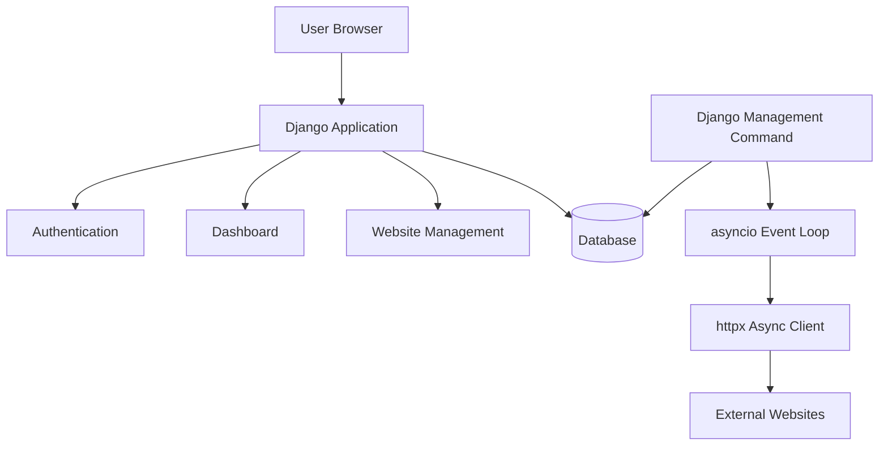
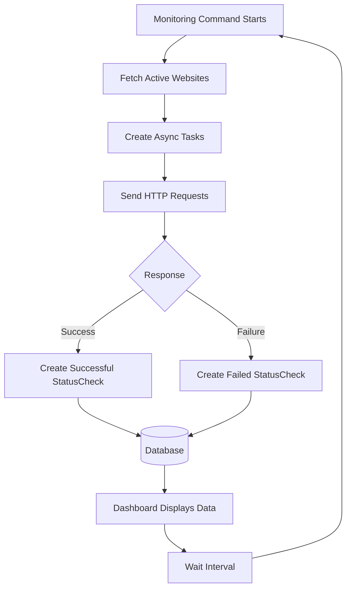
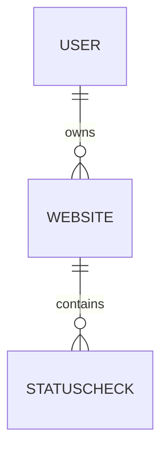

# 🚀 PingRadar

<div align="center">

### A website uptime monitoring system built with Django and asyncio

Monitor websites. Track uptime. Explore backend engineering.

[](https://www.python.org/)
[](https://www.djangoproject.com/)
[](https://docs.python.org/3/library/asyncio.html)
[](LICENSE)

</div>

---

## 📖 About The Project

PingRadar is a website uptime monitoring application built using Django.

The goal of this project is not only to build a working monitoring system, but also to understand how backend systems are designed, tested, optimized, and improved over time.

Through PingRadar, I explore:

* Django application architecture
* Database modeling and relationships
* Django ORM
* Asynchronous programming with asyncio
* Concurrent network requests
* HTTP monitoring systems
* Testing practices
* Performance optimization

This project is continuously evolving as my understanding of backend engineering grows.

---

# ✨ Features

## 🌐 Website Monitoring

PingRadar can:

* Monitor multiple websites
* Track website availability
* Store response latency
* Record HTTP status codes
* Maintain uptime history

---

## ⚡ Async Monitoring System

PingRadar uses asynchronous I/O to efficiently check multiple websites.

Current implementation uses:

* `asyncio`
* `httpx.AsyncClient`
* Django management commands

The monitoring flow:

```
Django Management Command
          |
          ↓
Fetch Active Websites
          |
          ↓
Create Async HTTP Tasks
          |
          ↓
Check Website Availability
          |
          ↓
Save StatusCheck Records
```

---

## 📊 Dashboard

The dashboard provides:

* User websites
* Current website status
* Uptime percentage
* Response information
* Monitoring history

---

## 🔐 Authentication & Ownership

Implemented:

* User registration
* Login/logout
* User-specific websites
* Ownership-based access protection

Users can only manage their own websites.

---

# 🏗️ Architecture



PingRadar currently runs as two main processes:

| Process            | Responsibility                                            |
| ------------------ | --------------------------------------------------------- |
| Django Server      | Handles authentication, dashboard, and website management |
| Monitoring Command | Performs periodic website health checks                   |

---

# 🔄 Monitoring Workflow



---

# 🗄️ Database Design

## Website

Stores monitored website information:

* Owner
* Name
* URL
* Created timestamp
* Pause status

---

## StatusCheck

Stores monitoring results:

* `website` — related website
* `is_up` — whether the website was reachable
* `timestamp` — when the check was performed
* `response_time_ms` — response latency
* `status_code` — HTTP response code

Relationship:



---

# 🧪 Testing

PingRadar uses Django's built-in testing framework.

Current test coverage:

## Website Tests

`WebsiteModelTestCase`

Covers:

* Uptime calculation with no checks
* 100% uptime calculation
* Mixed uptime calculation

---

## StatusCheck Tests

`StatusCheckModelTestCase`

Covers:

* StatusCheck creation
* Website relationship validation
* Monitoring result storage

---

## Security Tests

`WebsiteSecurityTestCase`

Covers:

* Owner access validation
* Unauthorized user access prevention

---

Run tests:

```bash
python manage.py test monitor
```

---

# ⚡ Performance Benchmark

PingRadar includes a benchmark tool to compare sequential and asynchronous HTTP requests.

The benchmark compares:

### Sequential

Using:

```
httpx.Client
```

Requests are executed one after another.

### Concurrent

Using:

```
httpx.AsyncClient
asyncio.gather()
```

Multiple requests execute concurrently.

---

The benchmark tests different scenarios:

* Normal responses
* Slow responses
* Error responses
* Timeout responses
* Randomized responses

Example result:

| Method              |         Time |
| ------------------- | -----------: |
| Sequential requests | ~145 seconds |
| Concurrent requests |  ~15 seconds |

Result:

```
~9x faster with concurrent execution
```

This demonstrates the advantage of asynchronous programming for I/O-bound workloads.

Run:

```bash
python benchmark.py
```

---

# 🧰 Development Tools

PingRadar includes internal tools for development and testing.

## Mock Server

A custom asynchronous mock HTTP server was built to simulate:

* Successful responses
* Slow responses
* Timeout scenarios
* Server errors
* Random failures

This allows monitoring behavior to be tested without depending on external websites.

---

## Custom Router

The mock server includes a lightweight decorator-based router:

Example:

```python
@route("/slow")
async def slow_handler():
    return 200, "Slow response"
```

This helped explore:

* Request routing
* Decorators
* Handler registration
* Async request handling

---

# ⚠️ Known Limitations

PingRadar is an active learning project and some parts are intentionally not production-ready.

## Dashboard Query Optimization

The dashboard currently performs additional database queries while retrieving website status information.

Current size:

✅ Works correctly

Future improvements:

* Django ORM optimization
* Database annotations
* Better query planning

---

## Current Planned Improvements

* PostgreSQL support
* Better background scheduling
* Notification system
* REST API
* Live dashboard updates

---

# 📁 Project Structure

```text
PingRadar/

├── monitor/
│   ├── management/
│   │   └── commands/
│   │       └── run_monitor.py
│   ├── migrations/
│   ├── models.py
│   ├── tests.py
│   ├── urls.py
│   └── views.py
│
├── pingradar_project/
│   ├── settings.py
│   ├── urls.py
│   ├── asgi.py
│   └── wsgi.py
│
├── mock_server.py
├── router.py
├── handlers.py
├── test_router.py
├── benchmark.py
│
├── manage.py
├── requirements.txt
├── LICENSE
└── README.md
```

---

# 🚀 Installation

Clone repository:

```bash
git clone https://github.com/iamNaman-official/PingRadar.git

cd PingRadar
```

Create virtual environment:

```bash
python -m venv venv
```

Activate:

Linux/macOS:

```bash
source venv/bin/activate
```

Windows:

```bash
venv\Scripts\activate
```

Install dependencies:

```bash
pip install -r requirements.txt
```

Run migrations:

```bash
python manage.py migrate
```

Start Django server:

```bash
python manage.py runserver
```

Start monitoring:

```bash
python manage.py run_monitor
```

---

# 📚 Documentation

Detailed documentation:

* Architecture → `docs/ARCHITECTURE.md`
* Database → `docs/DATABASE.md`
* Testing → `docs/TESTING.md`
* Development Journey → `docs/DEVELOPMENT.md`
* Roadmap → `docs/ROADMAP.md`

---

# 📚 Learning Journey

PingRadar represents my journey while learning backend engineering.

This project helps me understand:

* How backend applications are structured
* How databases store information
* How asynchronous systems work
* How performance problems appear
* How testing improves reliability
* How software evolves through iteration

The goal is not to build a perfect system immediately, but to continuously improve by understanding problems and solving them.

---

## 🤖 AI Usage

AI tools were used as development assistance during the project.

AI was used for:

- Frontend development assistance and UI implementation
- Exploring frontend design ideas and improving user interface components
- Debugging support
- Documentation improvements
- Understanding technical concepts and exploring possible approaches

The backend architecture, database design, monitoring system, asynchronous implementation, testing strategy, and overall project decisions were designed, implemented, and reviewed by me.

AI was used as a productivity and learning tool, while all final code decisions and project direction were maintained by me.

---

# 🛣️ Roadmap

* [ ] Email notifications
* [ ] Discord notifications
* [ ] Telegram notifications
* [ ] PostgreSQL migration
* [ ] Docker support
* [ ] REST API
* [ ] Celery + Redis
* [ ] WebSocket dashboard
* [ ] Prometheus metrics
* [ ] Grafana dashboards

---

# 📄 License

This project is licensed under the MIT License.

---

# 👨‍💻 Author

**Naman**

GitHub:
https://github.com/iamNaman-official
