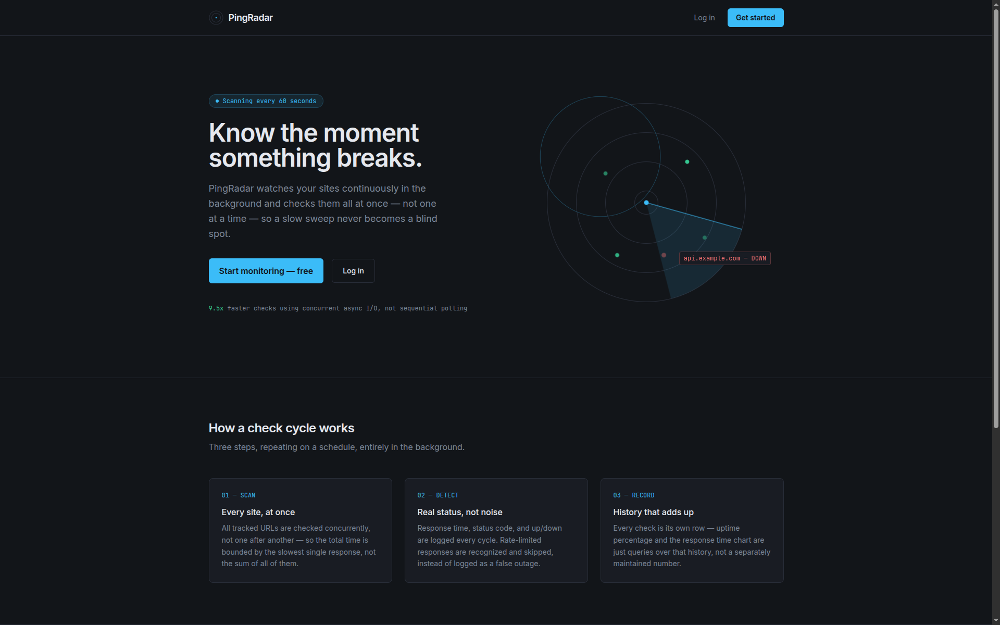
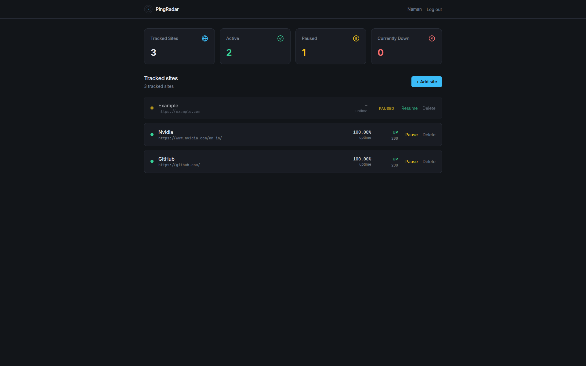
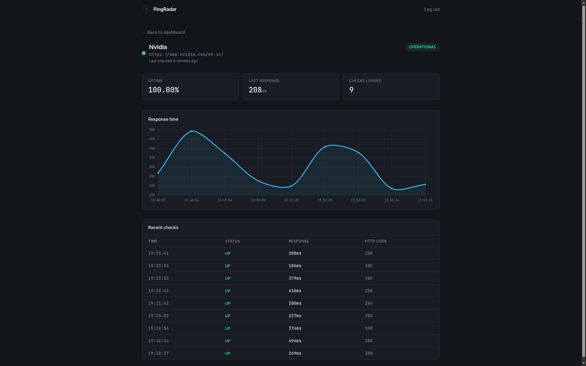
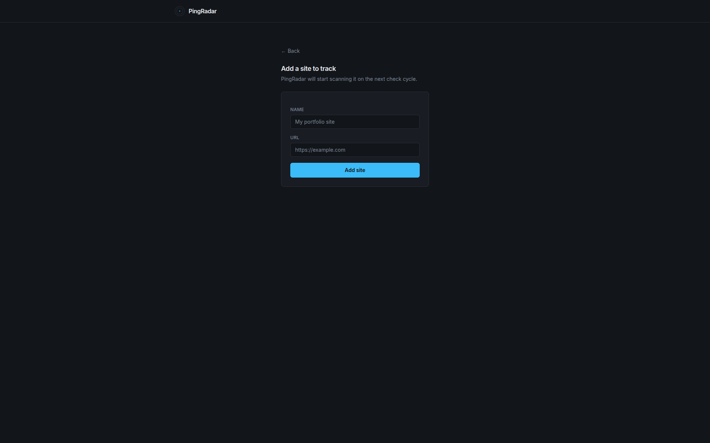
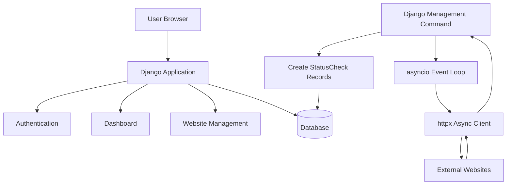
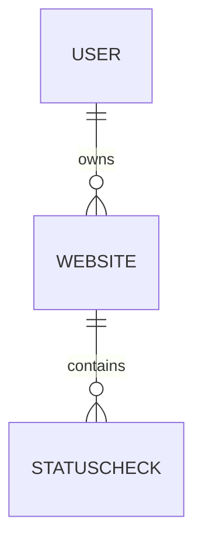

<div align="center">

# 🚀 PingRadar

### A website uptime monitoring system built with Django and asyncio

Monitor websites. Track uptime. Explore backend engineering.

[](https://www.python.org/)
[](https://www.djangoproject.com/)
[](https://docs.python.org/3/library/asyncio.html)
[](LICENSE)
[](https://github.com/iamNaman-official/PingRadar/actions)

</div>

---

## 📖 About The Project

PingRadar is a website uptime monitoring application built using Django. The project focuses on understanding core backend engineering concepts:

- Django architecture
- Database modeling and Django ORM
- Authentication and authorization
- Async programming with `asyncio`
- Concurrent HTTP monitoring
- Automated testing
- CI/CD practices
- Performance optimization

---

## 🖥️ Application Screenshots

### 🌐 Landing Page


### 📊 Dashboard


### 📈 Website Details


### ➕ Add Website


---

## ✨ Features

- **🌐 Website Monitoring:** Monitor multiple websites, track availability, store response latency, record HTTP status codes, and maintain uptime history.
- **⚡ Async Monitoring System:** Uses `asyncio`, `httpx.AsyncClient`, and Django management commands for concurrent HTTP health checks.
- **📊 Dashboard:** Provides a website overview, current status, uptime percentage, response information, and monitoring history.
- **🔐 Authentication:** Secure user registration, login/logout, user-specific websites, and ownership protection.

---

## 🛠️ Tech Stack

### Backend
- Python 3.12+
- Django
- Django ORM

### Async Processing
- asyncio
- httpx

### Database
- SQLite (development)

### Testing & Quality
- Django TestCase
- Ruff
- GitHub Actions
- CodeQL

---

## 🏗️ Architecture


PingRadar runs as two distinct processes:

| Process | Responsibility |
|---------|----------------|
| **Django Server** | Handles user requests, dashboard rendering, and website management. |
| **Monitoring Worker** | Executes background health checks and database updates. |

---

## 🚀 Getting Started

Follow these instructions to set up the project locally on your machine for development and testing purposes.

### Prerequisites

Ensure you have the following installed on your local machine:
- [Python 3.12+](https://www.python.org/downloads/)
- [Git](https://git-scm.com/)
- pip (Python package installer)

### Installation

1. **Clone the repository:**
   ```bash
   git clone https://github.com/iamNaman-official/PingRadar.git
   cd PingRadar
   ```

2. **Set up a virtual environment:**
   ```bash
   # On macOS and Linux:
   python3 -m venv venv
   source venv/bin/activate
   
   # On Windows:
   python -m venv venv
   venv\Scripts\activate
   ```

3. **Install dependencies:**
   ```bash
   pip install -r requirements.txt
   ```

4. **Run database migrations:**
   ```bash
   python manage.py migrate
   ```

5. **Start the Django development server:**
   ```bash
   python manage.py runserver
   ```

6. **Start the monitoring worker (in a new terminal window/tab):**
   ```bash
   # Don't forget to activate the virtual environment in the new terminal

   #Linux or macos
   source venv/bin/activate

   # Windows
   venv\Scripts\activate 

   python manage.py run_monitor
   ```

---

## 🗄️ Database Design

### Models

- **Website:** Stores details like Owner, Name, URL, Created timestamp, and Pause status.
- **StatusCheck:** Stores Website relation, Availability status, Timestamp, Response time, and HTTP status code.

### Relationships



*Database improvements include unique constraints to prevent duplicate websites per user and indexing to improve status history queries.*

---

## 🧪 Testing

Test coverage includes:

- Model behavior
- Authentication flows
- User ownership protection
- Website creation validation
- Duplicate website prevention
- Pause/resume functionality

To run the test suite:
```bash
python manage.py test monitor
```

---

## ⚡ Performance Benchmark

A benchmark is included to compare sequential (`httpx.Client`) vs. concurrent (`httpx.AsyncClient` + `asyncio.gather()`) execution across various response scenarios (normal, slow, errors, timeouts).

To run the benchmark:

1. **Start the mock server** in one terminal:
   ```bash
   python mock_server.py
   ```

2. **Run the benchmark** in a second terminal:
   ```bash
   python benchmark.py
   ```

3. **View the stats**: After the benchmark completes, press `Ctrl+C` in the first terminal (where the mock server is running) to stop it and view the server statistics.

---

## 🧰 Development Tools

- **Mock Server:** A custom async server for testing various scenarios (successful, slow, timeout, errors).
- **Custom Router:** Decorator-based routing for the mock server.

---

## 📁 Project Structure

```text
PingRadar/
├── monitor/
│   ├── management/commands/run_monitor.py
│   ├── models.py
│   ├── tests.py
│   ├── urls.py
│   └── views.py
│
├── pingradar_project/
│
├── docs/
│   ├── ARCHITECTURE.md
│   ├── DATABASE.md
│   ├── TESTING.md
│   ├── DEVELOPMENT.md
│   └── ROADMAP.md
│
├── mock_server.py
├── router.py
├── handlers.py
├── benchmark.py
├── manage.py
└── requirements.txt
```

---

## 📚 Documentation

For more in-depth information, please refer to the specific documentation files:

- [Architecture](docs/ARCHITECTURE.md)
- [Database](docs/DATABASE.md)
- [Testing](docs/TESTING.md)
- [Development Journey](docs/DEVELOPMENT.md)
- [Roadmap](docs/ROADMAP.md)

---

## 📚 Learning Journey

PingRadar represents my journey while exploring backend engineering.

Through this project, I learned:

- How Django applications are structured
- How database relationships and ORM work
- How asynchronous systems handle I/O workloads
- How to design background processes
- How testing improves reliability
- How software evolves through continuous improvement

The goal of this project was not only to build a working application, but to understand the engineering decisions behind building backend systems.

---

## 🤖 AI Usage

AI tools were used as development assistants and learning support during this project.

As a beginner exploring backend engineering, AI helped me understand concepts, explore approaches, debug issues, review implementation decisions, and improve documentation.

AI was used for:

- Frontend development assistance and UI implementation
- Exploring UI ideas
- Understanding Django concepts and backend architecture
- Guidance while designing models, views, testing strategies, and project structure
- Debugging and understanding errors
- Documentation improvements
- Learning concepts related to async programming, databases, and ORM

The architecture, database design, monitoring system, implementation decisions, testing strategy, and final code were designed, implemented, tested, and reviewed by me.

AI was used as a productivity and learning tool while maintaining ownership of engineering decisions.

---

## ⚠️ Current Limitations

PingRadar is currently a learning-focused project.

Current limitations:

- Uses SQLite for development
- Monitoring worker runs separately
- No notification system yet
- Background scheduling is basic
- Dashboard queries can be optimized further

### Database Query Optimization

The dashboard currently has potential N+1 query issues when retrieving website monitoring information.

Example:

- Fetch all websites
- Then fetch the latest status check for each website separately

For a small number of websites this works correctly, but with a larger number of monitored websites it can create unnecessary database queries.

Future improvements:

- Use Django ORM optimization techniques like `select_related()` and `prefetch_related()`
- Use database annotations for aggregated data
- Improve query planning and monitoring performance

Future versions will focus on production deployment improvements.

---

## 🛣️ Roadmap
Completed:

- [x] GitHub Actions CI pipeline
- [x] Automated testing
- [x] Code quality checks

Future:

- [ ] Email notifications
- [ ] Discord notifications
- [ ] Telegram notifications
- [ ] PostgreSQL migration
- [ ] Docker support
- [ ] REST API
- [ ] Celery + Redis
- [ ] WebSocket dashboard
- [ ] Prometheus metrics
- [ ] Grafana dashboards

---

## 📄 License

Distributed under the MIT License. See `LICENSE` for more information.

---

## 👨‍💻 Author

**Naman**
- GitHub: [@iamNaman-official](https://github.com/iamNaman-official)
