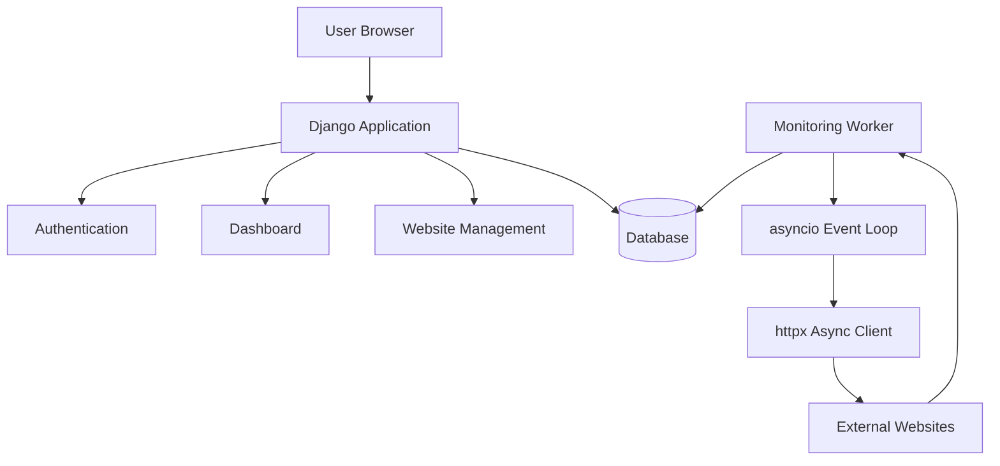
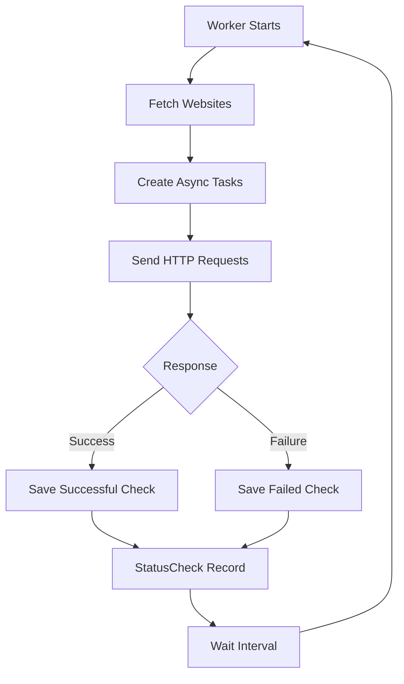
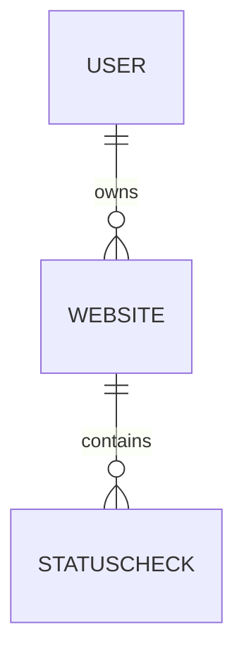

<div align="center">

# 🚀 PingRadar

### A real-time website uptime monitoring system built with Django and asyncio

Monitor websites. Track uptime. Explore backend engineering.

[](https://www.python.org/)
[](https://www.djangoproject.com/)
[](https://docs.python.org/3/library/asyncio.html)
[](LICENSE)

PingRadar is an evolving backend engineering project where I explore Django, database design, asynchronous programming, monitoring systems, and scalable backend architecture.

</div>

---

## 📖 About The Project

PingRadar is a website uptime monitoring application built using Django.

The goal of this project is not only to create a working monitoring system, but also to understand how backend systems are designed, optimized, tested, and improved over time.

Through PingRadar, I am learning and exploring:

- Django application architecture
- Database modeling and relationships
- Django ORM
- Async programming using asyncio
- Concurrent network requests
- Background workers
- Testing practices
- Performance optimization

This project is continuously improving as my understanding of backend engineering grows.

---

## ✨ Features

### 🌐 Website Monitoring
- Monitor multiple websites
- Track availability status
- Store response times
- Record HTTP status codes
- Maintain uptime history

### ⚡ Async Monitoring Worker
PingRadar uses asynchronous I/O for handling multiple website checks.

Current approach:
- `asyncio`
- `httpx`
- Django management commands

### 📊 Dashboard
The dashboard provides:
- Tracked websites
- Website status
- Uptime percentage
- Response information
- Monitoring history

### 🔐 Authentication
Includes:
- User registration
- Login/logout
- User-specific websites
- Ownership protection

---

## 🏗️ Architecture



PingRadar currently works as two separate processes:

| Process | Responsibility |
|---------|----------------|
| **Django Server** | Handles users, dashboard, and website management |
| **Monitoring Worker** | Performs background health checks |

---

## 🔄 Monitoring Workflow



---

## 🗄️ Database Design

Current main models:

### Website
Stores monitored website information:
- Owner
- Name
- URL
- Created timestamp
- Pause status

### StatusCheck
Stores monitoring results:
- Website relation
- Timestamp
- Availability status
- Response time
- HTTP status code

Relationship:



---

## ⚡ Performance Benchmark

PingRadar includes a benchmark comparing sequential and concurrent monitoring.

Example result:

| Method | Time |
|--------|------|
| Sequential requests | 20.21 seconds |
| Async concurrent requests | 2.12 seconds |

The benchmark demonstrates how asynchronous programming helps with I/O-heavy workloads.

Run benchmark:
```bash
python benchmark.py
```

---

## 🧪 Testing

Current tests cover:

### Model Testing
- Uptime calculation with no checks
- All websites available
- All websites unavailable
- Mixed uptime calculation

### Security Testing
- User ownership validation
- Unauthorized access prevention

### Behaviour Testing
- Website deletion
- Correct database behaviour

Run tests:
```bash
python manage.py test monitor
```

---

## ⚠️ Known Limitations

PingRadar is an active learning project. Some areas are intentionally not production-ready yet.

### Dashboard Query Optimization
The dashboard currently performs additional database queries while retrieving website status information. At the current project size this works correctly, but it can become inefficient as the number of monitored websites increases.

Future improvement:
- Django ORM optimization
- Database annotations
- Better query planning

I am currently learning these concepts and will improve this part as my understanding of database optimization grows.

### Other Planned Improvements
- PostgreSQL support
- Background task queues
- Live dashboard updates
- Notification system

---

## 📁 Project Structure

<details>
<summary>Click to expand</summary>

```text
PingRadar/
├── monitor/
│   ├── management/
│   │   └── commands/
│   │       └── run_monitor.py
│   ├── migrations/
│   ├── static/
│   ├── templates/
│   ├── admin.py
│   ├── models.py
│   ├── tests.py
│   ├── urls.py
│   └── views.py
├── pingradar_project/
│   ├── settings.py
│   ├── urls.py
│   ├── asgi.py
│   └── wsgi.py
├── benchmark.py
├── manage.py
├── requirements.txt
├── LICENSE
└── README.md
```

</details>

---

## 🚀 Installation

Clone repository:
```bash
git clone https://github.com/iamNaman-official/PingRadar.git
cd PingRadar
```

Create virtual environment:
```bash
python -m venv venv
```

Activate environment:

**Windows:**
```bash
venv\Scripts\activate
```

**Linux/macOS:**
```bash
source venv/bin/activate
```

Install dependencies:
```bash
pip install -r requirements.txt
```

Create environment file:
```env
SECRET_KEY=your_secret_key
DEBUG=True
ALLOWED_HOSTS=127.0.0.1,localhost
```

Run migrations:
```bash
python manage.py migrate
```

Start server:
```bash
python manage.py runserver
```

Start monitoring worker:
```bash
python manage.py run_monitor
```

---

## 📚 Documentation

Detailed documentation:
- 🏗️ Architecture → `docs/ARCHITECTURE.md`
- 🗄️ Database → `docs/DATABASE.md`
- 🧪 Testing → `docs/TESTING.md`
- 🧑‍💻 Development Journey → `docs/DEVELOPMENT.md`
- 🛣️ Roadmap → `docs/ROADMAP.md`

---

## 📚 Learning Journey

PingRadar represents my journey while learning backend engineering.

This project helps me understand:
- How backend applications are structured
- How databases store and retrieve information
- How asynchronous systems work
- How performance problems appear
- How software improves through iteration

The goal is not to claim that the project is perfect. The goal is to build, identify problems, understand them, and improve step by step.

---

## 🤖 AI Usage

AI tools were used as development assistance for:
- Exploring ideas
- Frontend acceleration
- Debugging support
- Documentation assistance

All architecture decisions, backend implementation, testing, and project direction are reviewed and maintained by me.

---

## 🛣️ Roadmap

- [ ] Email notifications
- [ ] Discord notifications
- [ ] Telegram notifications
- [ ] PostgreSQL migration
- [ ] Docker support
- [ ] REST API
- [ ] Celery + Redis
- [ ] WebSocket dashboard
- [ ] Prometheus metrics
- [ ] Grafana dashboards

---

## 📄 License

This project is licensed under the MIT License.

---

## 👨‍💻 Author

**Naman**
- GitHub: [iamNaman-official](https://github.com/iamNaman-official)
