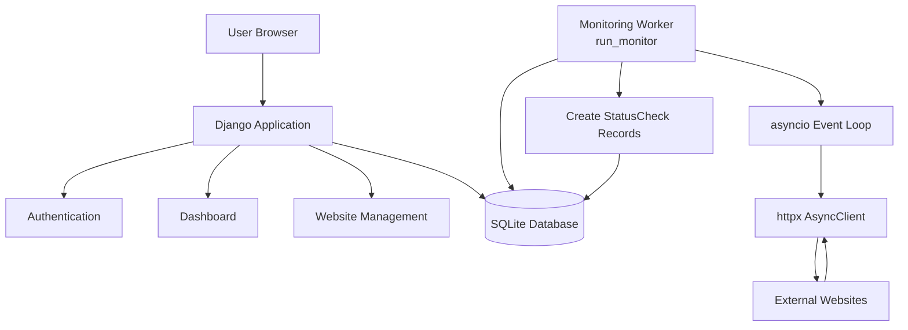
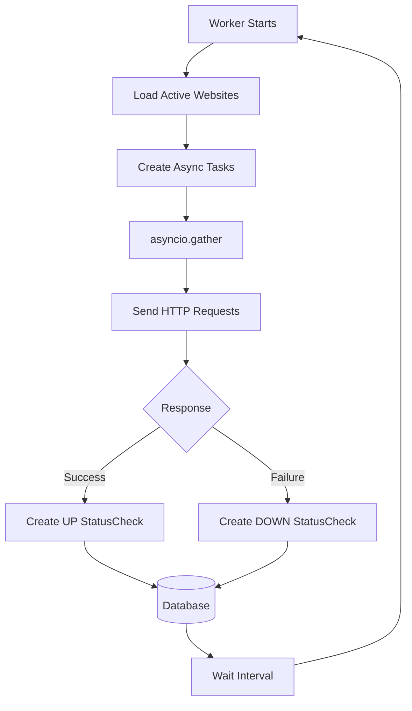
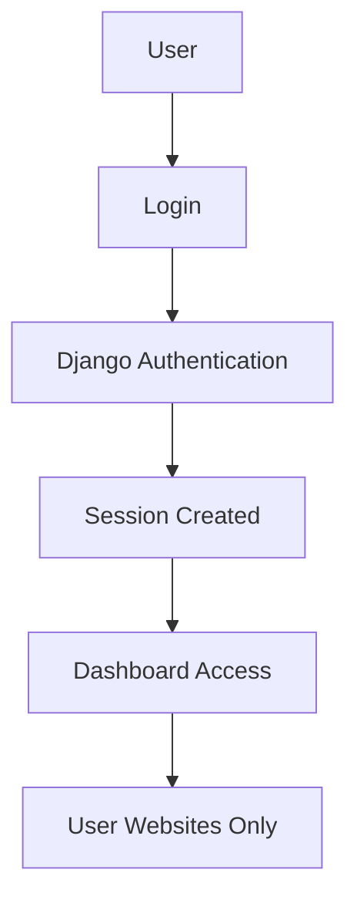
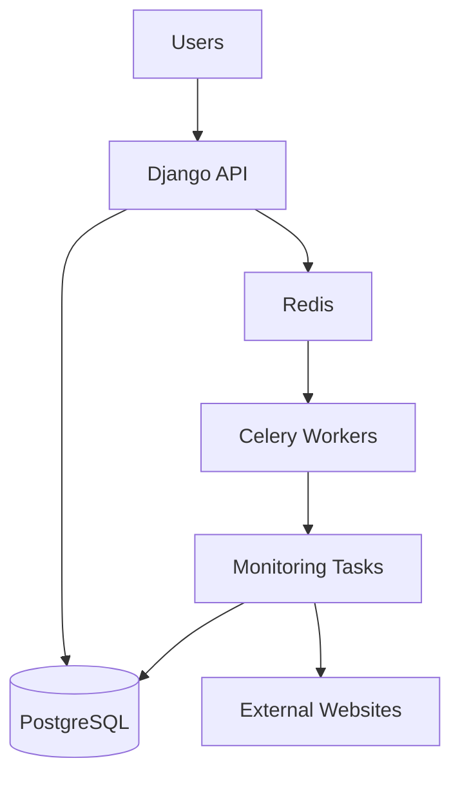

# 🏗️ PingRadar Architecture

## Overview

PingRadar is a Django-based website uptime monitoring system designed to separate the user-facing web application from the background monitoring process.

The main architectural goal is to keep website monitoring tasks independent from normal user requests so that slow network operations do not affect dashboard performance.

The system currently contains two main processes:

1. Django Web Application
2. Background Monitoring Worker

Both processes communicate through the shared database.

---

# 🧩 System Components

PingRadar consists of the following major components:

| Component | Responsibility |
|-----------|---------------|
| Django Application | Handles users, authentication, dashboards, and website management |
| Monitoring Worker | Performs background website health checks |
| Database | Stores users, websites, and monitoring results |
| External Websites | Target systems being monitored |

---

# 🧩 High-Level Architecture



PingRadar currently runs as two separate processes:

| Process | Responsibility |
|---------|----------------|
| Django Server | Handles user requests, authentication, dashboard rendering, and website management |
| Monitoring Worker | Performs background website health checks and stores monitoring results |

---

# 🖥️ Django Application

The Django application handles all user-facing operations.

Responsibilities:

- User authentication
- Website creation
- Website deletion
- Dashboard rendering
- Displaying monitoring history
- Managing user ownership
- Handling website CRUD operations

The web server does not perform monitoring directly.

This keeps long-running network operations away from normal HTTP requests.

---

# ❓ Why Separate Monitoring From Django Views?

Website monitoring involves external network communication, which can be slow or unpredictable.

If monitoring was performed directly inside Django views:

- User requests would become slower
- Network failures could affect users
- Long-running operations would block responses
- Scaling would become difficult

Separating responsibilities keeps the architecture cleaner:

### Django Application

Responsible for:

- User interaction
- Authentication
- Dashboard rendering
- Website management


### Monitoring Worker

Responsible for:

- Health checks
- Network communication
- Response measurement
- Saving monitoring results

---

# 🔄 Django Request Flow

A normal dashboard request follows this flow:

```text
User Browser

      |
      v

Django URL Router

      |
      v

View Function

      |
      v

Django ORM Query

      |
      v

Database

      |
      v

Template Rendering

      |
      v

HTML Response
```

The Django application retrieves required information using Django ORM and renders the dashboard.

---

# ⚙️ Monitoring Worker

The monitoring worker runs as a Django management command:

```bash
python manage.py run_monitor
```

The worker runs separately from the Django web server.

Responsibilities:

- Fetch websites from database
- Perform health checks
- Measure response time
- Store monitoring results
- Repeat checks periodically

Because it runs inside Django's context, it can directly use:

- Django settings
- Django ORM
- Project models

---

# 🔄 Monitoring Lifecycle



Complete monitoring cycle:

1. Worker starts
2. Fetch monitored websites
3. Create asynchronous tasks
4. Send HTTP requests
5. Receive responses
6. Calculate response time
7. Create StatusCheck records
8. Dashboard displays updated information

---

# ⚡ Async Monitoring Design

Website monitoring is an I/O-heavy problem.

Most of the execution time is spent waiting for external servers to respond.

## Sequential Approach

```text
Website A
   |
   wait
   |
Website B
   |
   wait
   |
Website C
```

Each request waits for the previous request to complete.

---

## Async Approach

```text
Website A ───┐
Website B ───┼── asyncio.gather()
Website C ───┘
```

Multiple requests can wait at the same time.

PingRadar uses:

- `asyncio`
- `httpx.AsyncClient`
- concurrent tasks

to improve monitoring efficiency.

Important:

`asyncio` does not create a new thread for every request.

Instead, it uses cooperative multitasking where tasks pause during I/O waits and allow other tasks to continue execution.

---

# 🌐 External Website Communication

The monitoring flow:

```text
Monitoring Worker

        |
        v

HTTP Request

        |
        v

External Website

        |
        v

HTTP Response

        |
        v

Process Result

        |
        v

Create StatusCheck

        |
        v

Database
```

Each monitoring result is stored for future analysis.

---

# 🗄️ Database Communication

The database acts as the shared communication layer between processes.

## Django Application

Reads:

- Website information
- Monitoring history
- Status information

Displays:

- Dashboard data
- Website details


## Monitoring Worker

Reads:

- Websites that need monitoring

Creates:

- StatusCheck records


Flow:

```text
Website

   |
   v

StatusCheck

   |
   v

Database

   |
   v

Dashboard Query
```

---

# 🔐 Authentication Flow



Users can only access and manage websites that belong to them.

---

# 🧠 Current Architecture Decisions

## SQLite Database

SQLite is currently used because:

- Easy setup
- Suitable for development
- No extra infrastructure required

Future improvement:

- PostgreSQL migration

---

## Single Monitoring Worker

Current design:

```text
Single Worker

      |
      |
Multiple Website Checks
```

This works well for the current project scale.

Future design:

```text
Multiple Workers

Worker 1
Worker 2
Worker 3

      |
      |
Task Queue
```

Possible technologies:

- Celery
- Redis

---

# ⚠️ Known Architecture Limitations

## Dashboard Query Optimization

The dashboard currently has potential N+1 query issues when retrieving website monitoring information.

Example:

```
Fetch all websites

       |

Fetch latest StatusCheck separately for each website
```

For a small number of websites this works correctly.

However, with thousands of monitored websites, this can create unnecessary database queries.

Possible improvements:

- Django ORM annotations
- `select_related()`
- `prefetch_related()`
- Better query planning
- Database indexes
- Cached statistics

---

## No Real-Time Updates

Currently the dashboard updates through normal page refresh.

Future improvements:

- WebSockets
- Django Channels
- Live status updates

---

# 🔁 Architecture Evolution

## Current Architecture

```text
Django Application

        |

     SQLite Database

        |

Monitoring Worker
```

Suitable for:

- Learning
- Development
- Small monitoring workloads

---

## Future Production Architecture

```text
Django API

        |

   PostgreSQL

        |

 Redis Queue

        |

 Celery Workers

        |

 Monitoring Tasks

        |

External Websites
```

Suitable for:

- Large number of websites
- Distributed monitoring
- Production workloads

---

# 🚀 Future Architecture



A production-style architecture would provide:

- Multiple monitoring workers
- Better scheduling
- Retry failed tasks
- Distributed execution
- Higher scalability
- Real-time updates

---

# 📚 Learning Notes

PingRadar is an evolving backend engineering project.

The current architecture represents my understanding of:

- Django application design
- Database communication
- Async programming
- Background processing
- Backend scalability

Some parts are intentionally simple because the goal is to understand fundamentals before introducing complex infrastructure.

As I continue learning:

- Database optimization
- Distributed systems
- Task queues
- Backend scalability

I plan to revisit and improve these areas.