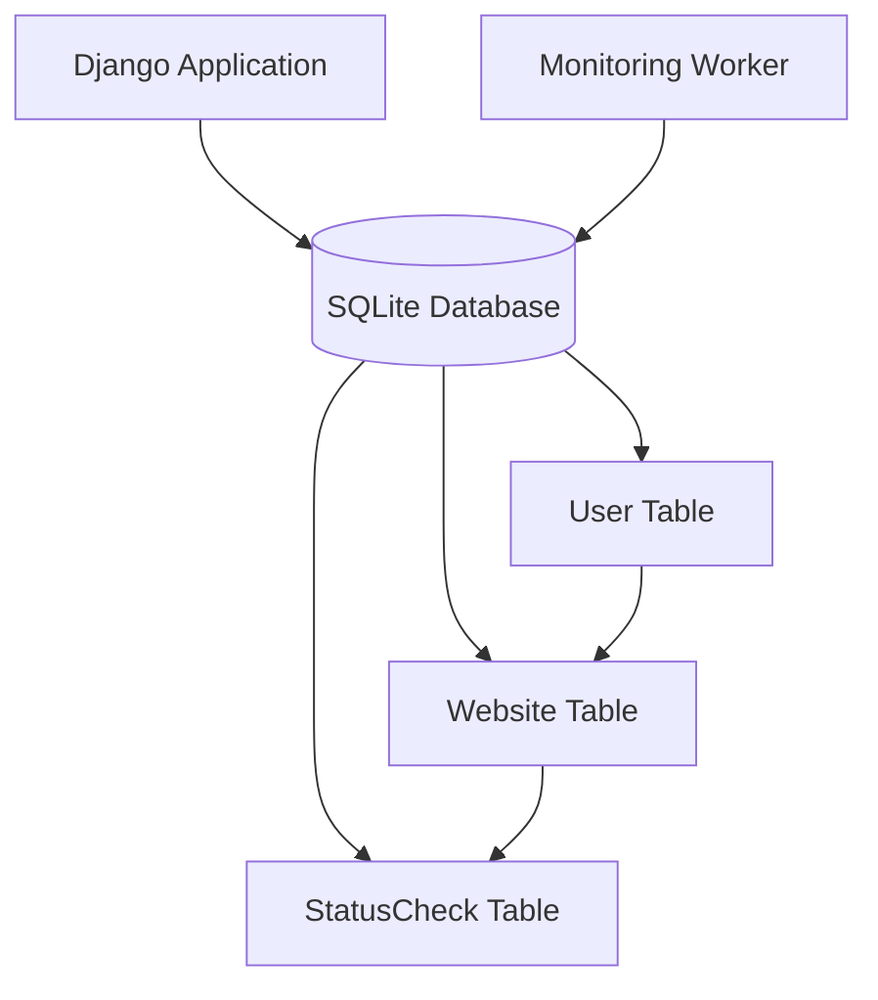
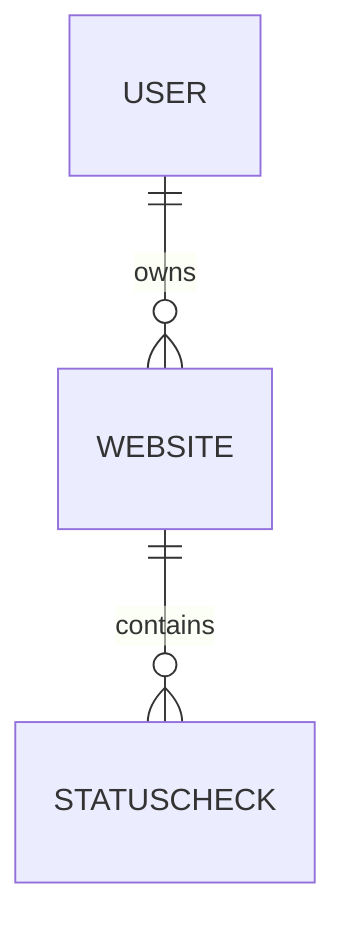

# 🗄️ PingRadar Database Design

## Overview

PingRadar uses a relational database managed through Django ORM.

The database acts as the shared storage layer between the two main system components:

1. Django Web Application
2. Background Monitoring Worker

The Django application uses the database to store:

- User accounts
- Websites being monitored
- Website monitoring results

The monitoring worker reads websites from the database, performs health checks, and stores the results back as monitoring records.

Currently, PingRadar uses:

```
SQLite
```

for development because it provides:

- Simple setup
- No additional infrastructure requirements
- Easy local development

Future production deployments can migrate to PostgreSQL.

---

# 🧩 Database Architecture



The database is shared between the Django application and the monitoring worker.

---

# 🗄️ Entity Relationship Diagram



Relationship summary:

```
User

 |
 |
Many Websites

 |
 |
Many StatusChecks
```

---

# 👤 User Model

PingRadar uses Django's built-in `User` model.

The user model handles:

- Authentication
- Login credentials
- User identity
- Ownership relationships

The relationship is defined in the Website model:

```python
owner = models.ForeignKey(
    User,
    on_delete=models.CASCADE,
    related_name='websites'
)
```

---

## User → Website Relationship

One user can own multiple monitored websites.

Example:

```
User: Naman

        |
        |
        +---- github.com
        |
        +---- example.com
        |
        +---- mywebsite.com
```

Django reverse relationship:

Without `related_name`:

```python
user.website_set.all()
```

With current implementation:

```python
user.websites.all()
```

The custom `related_name` provides a cleaner reverse lookup.

---

# 🌐 Website Model

The `Website` model represents a website that the user wants to monitor.

Model:

```python
class Website(models.Model):
```

---

## Fields

| Field | Type | Description |
|---|---|---|
| owner | ForeignKey | User who owns the website |
| name | CharField | Display name of the website |
| url | URLField | Website address |
| created_at | DateTimeField | Time when website was added |
| is_paused | BooleanField | Controls whether monitoring is active |

---

# Field Details

## owner

```python
owner = models.ForeignKey(
    User,
    on_delete=models.CASCADE,
    related_name='websites'
)
```

Purpose:

Connects every website to its owner.

Example:

```
User
 |
 |
Website
```

`on_delete=models.CASCADE` means:

If a user is deleted:

```
User deleted

      ↓

Owned websites deleted
```

---

## name

```python
name = models.CharField(max_length=100)
```

Stores the display name of the website.

Example:

```
"Google"
"Portfolio Website"
```

---

## url

```python
url = models.URLField(max_length=200)
```

Stores the website URL.

Example:

```
https://example.com
```

---

## created_at

```python
created_at = models.DateTimeField(
    auto_now_add=True
)
```

Automatically stores when the website was created.

Example:

```
Website Added

      ↓

created_at = 2026-08-05 10:30
```

---

## is_paused

```python
is_paused = models.BooleanField(
    default=False
)
```

Controls monitoring status.

Values:

| Value | Meaning |
|-|-|
| False | Website monitoring active |
| True | Monitoring paused |

---

# 📊 StatusCheck Model

The `StatusCheck` model stores every monitoring result.

Each time the worker checks a website, a new StatusCheck record is created.

Model:

```python
class StatusCheck(models.Model):
```

---

# Fields

| Field | Type | Description |
|---|---|---|
| website | ForeignKey | Related monitored website |
| timestamp | DateTimeField | Time of health check |
| is_up | BooleanField | Website availability status |
| response_time_ms | IntegerField | Request response time |
| status_code | IntegerField | HTTP response code |

---

# Field Details

## website

```python
website = models.ForeignKey(
    Website,
    on_delete=models.CASCADE,
    related_name='checks'
)
```

Connects a monitoring result to a website.

Relationship:

```
Website

   |
   |
Many StatusChecks
```

Reverse lookup:

```python
website.checks.all()
```

---

## timestamp

```python
timestamp = models.DateTimeField(
    auto_now_add=True,
    db_index=True
)
```

Stores when the monitoring check happened.

Example:

```
2026-08-05 21:00:00
```

The field also has:

```python
db_index=True
```

because timestamp queries are common.

Examples:

- Latest checks
- Monitoring history
- Sorting results

---

## is_up

```python
is_up = models.BooleanField()
```

Stores whether the website responded successfully.

Values:

| Value | Meaning |
|-|-|
| True | Website available |
| False | Website unavailable |

---

## response_time_ms

```python
response_time_ms = models.IntegerField(
    null=True,
    blank=True
)
```

Stores request latency.

Example:

```
120 ms
```

It allows:

```
NULL
```

because failed requests may not have response times.

---

## status_code

```python
status_code = models.IntegerField(
    null=True,
    blank=True
)
```

Stores HTTP response code.

Examples:

| Code | Meaning |
|-|-|
| 200 | Successful response |
| 404 | Not Found |
| 500 | Server Error |

Failed requests may not have a status code.

---

# 🔗 Database Relationships

## User → Website

Relationship:

```
One User

   |

Many Websites
```

Example:

```python
user.websites.all()
```

---

## Website → StatusCheck

Relationship:

```
One Website

      |

Many StatusChecks
```

Example:

```python
website.checks.all()
```

---

Example data:

```
User
 |
 |
Website
 |
 |
 +---- StatusCheck
 |
 +---- StatusCheck
 |
 +---- StatusCheck
```

---

# 🔒 Database Constraints

PingRadar prevents duplicate website monitoring entries for the same user.

Constraint:

```python
models.UniqueConstraint(
    fields=['owner', 'url'],
    name='unique_website_per_user'
)
```

Meaning:

A user cannot add the same URL twice.

Example:

Allowed:

```
User A

google.com
```

Not allowed:

```
User A

google.com
google.com
```

However:

```
User A

google.com


User B

google.com
```

is allowed.

---

# ⚡ Database Indexing

PingRadar adds an index for StatusCheck queries.

Implementation:

```python
models.Index(
    fields=[
        'website',
        '-timestamp'
    ]
)
```

Purpose:

Improve queries like:

```python
website.checks.all()
```

Especially:

- Latest status checks
- Monitoring history
- Dashboard loading

The index helps the database locate recent checks faster.

---

# 🧮 Model Helper Methods

The Website model contains additional logic.

---

# uptime_percentage()

```python
website.uptime_percentage()
```

Calculates website availability percentage.

Formula:

```
Successful Checks
----------------- × 100
Total Checks
```

Example:

```
100 successful checks

        /

100 total checks


= 100% uptime
```

Returns:

```
float
```

or:

```
None
```

when no checks exist.

---

# latest_check()

```python
website.latest_check()
```

Returns the latest monitoring result.

Example:

```
Website

 |
 |
Latest StatusCheck
```

Uses the ordering defined in StatusCheck:

```python
ordering = ['-timestamp']
```

---

# response_time_history()

```python
website.response_time_history()
```

Provides response time data for charts.

Returns:

```python
{
    "labels": [],
    "response_times": []
}
```

Used by the dashboard visualization.

---

# 🧪 Example ORM Queries

## Get user's websites

```python
Website.objects.filter(
    owner=user
)
```

---

## Get monitoring history

```python
website.checks.all()
```

---

## Get latest check

```python
website.checks.first()
```

---

## Find active websites

```python
Website.objects.filter(
    is_paused=False
)
```

---

# ⚠️ Current Database Limitations

## SQLite Usage

SQLite is suitable for:

- Development
- Learning
- Small workloads

Limitations:

- Limited concurrent writes
- Less suitable for large monitoring systems

Future improvement:

```
SQLite → PostgreSQL
```

---

## Query Optimization

The dashboard currently has possible N+1 query situations.

Example:

```
Fetch websites

        |

Fetch latest StatusCheck separately
for every website
```

For small numbers of websites this works correctly.

At larger scale, improvements would include:

- `select_related()`
- `prefetch_related()`
- ORM annotations
- Cached statistics
- Better query planning

---

# 🚀 Future Database Improvements

Possible improvements:

## PostgreSQL Migration

Benefits:

- Better scalability
- Improved concurrency
- Advanced indexing

---

## Status History Optimization

For very large monitoring history:

Possible approaches:

- Table partitioning
- Data retention policies
- Archiving old records

---

## Caching

Frequently requested data could be cached:

Examples:

- Latest status
- Uptime percentage
- Dashboard statistics

Possible technologies:

- Redis
- Django cache framework

---

# 📚 Learning Notes

The database design of PingRadar helped explore:

- Django ORM relationships
- Foreign keys
- Reverse relationships
- Database constraints
- Indexing
- Query optimization

The current design focuses on understanding relational database fundamentals before introducing more advanced production systems.