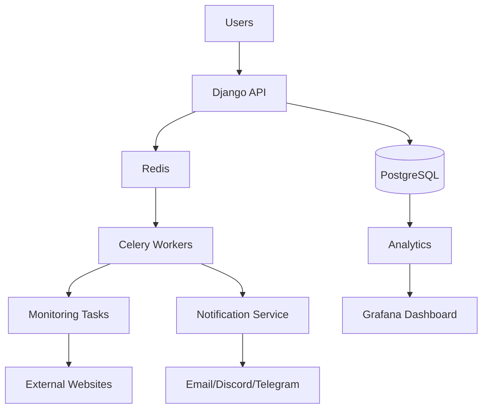

# 🚀 PingRadar Roadmap

## Overview

PingRadar is currently a learning-focused backend engineering project.

The current implementation focuses on understanding:

- Django architecture
- Database design
- Async programming
- Background processing
- Testing
- Performance optimization

The current system works correctly for its intended scale.

Future improvements focus on transforming PingRadar from a learning project into a more production-oriented monitoring platform.

---

# ✅ Completed Features

## Core Application

Completed:

- [x] Django project setup
- [x] User authentication
- [x] Website management
- [x] Website ownership protection
- [x] Dashboard interface
- [x] Website detail pages


---

## Monitoring System

Completed:

- [x] Background monitoring worker
- [x] Django management command
- [x] Async HTTP monitoring
- [x] Response time tracking
- [x] HTTP status tracking
- [x] Uptime calculation


---

## Database

Completed:

- [x] Website model
- [x] StatusCheck model
- [x] User relationships
- [x] Database constraints
- [x] Database indexing


Implemented optimizations:

- Unique constraint preventing duplicate websites per user
- Indexing for status history queries


---

## Testing and Quality

Completed:

- [x] Model tests
- [x] Authentication tests
- [x] Authorization tests
- [x] Website CRUD tests
- [x] Duplicate website validation tests
- [x] Pause/resume tests
- [x] GitHub Actions CI pipeline
- [x] Ruff code quality checks
- [x] CodeQL security scanning


---

# 🚧 Current Limitations

The current system is intentionally simple to focus on learning backend fundamentals.

---

# 1. Database Scalability

## Current

PingRadar uses:

```
SQLite
```

Advantages:

- Simple setup
- No additional infrastructure
- Good for development


Limitations:

- Limited concurrency
- Not ideal for production workloads
- Reduced scalability


## Future Improvement

Migration to:

```
PostgreSQL
```

Benefits:

- Better concurrency
- Advanced indexing
- Production-ready database features
- Better handling of large monitoring history


---

# 2. Background Worker Scaling

## Current

The monitoring system runs as:

```
Single Django Management Command

            |

     Async Monitoring Tasks
```

This works well for a small number of websites.


## Future Improvement

Introduce:

```
Task Queue

      |

Multiple Workers

      |

Monitoring Jobs
```


Possible technologies:

- Celery
- Redis


Benefits:

- Distributed workers
- Task retries
- Better scheduling
- Horizontal scaling


---

# 3. Advanced Scheduling System

## Current

The monitoring worker runs continuously and performs periodic checks.


## Future Improvement

Implement a dedicated scheduling system.

Possible solutions:

- Celery Beat
- Cron scheduling
- Task queues


Future capabilities:

- Different monitoring intervals
- User-defined schedules
- Priority monitoring
- Scheduled maintenance windows


---

# 4. Notification System

## Current

Monitoring results are only visible inside the dashboard.


## Future Improvement

Add alerting systems.

Planned:

- [ ] Email notifications
- [ ] Discord notifications
- [ ] Telegram notifications
- [ ] Slack notifications


Example workflow:

```
Website Down

      |

Monitoring Worker

      |

Notification Service

      |

User Alert
```


---

# 5. REST API

## Current

PingRadar is primarily a server-rendered Django application.


## Future Improvement

Add a REST API.

Possible endpoints:

```
GET    /api/websites/
POST   /api/websites/
GET    /api/checks/
DELETE /api/websites/<id>
```


Benefits:

- Mobile application support
- External integrations
- Better separation between frontend and backend


Possible technology:

- Django REST Framework


---

# 6. Real-Time Dashboard

## Current

Dashboard updates after page refresh.


## Future Improvement

Add real-time updates.

Possible technologies:

- WebSockets
- Django Channels


Future workflow:

```
Monitoring Worker

        |

New StatusCheck

        |

WebSocket Event

        |

Dashboard Update
```


Benefits:

- Live website status
- Real-time response updates
- Better monitoring experience


---

# 7. Database Query Optimization

## Current

The dashboard has potential N+1 query problems.

Example:

```
Fetch websites

       |

Fetch latest check for each website
```

This can create unnecessary database queries.


## Future Improvements

Use:

- `select_related()`
- `prefetch_related()`
- Database annotations
- Query optimization
- Cached statistics


Goal:

Reduce database load while supporting larger numbers of monitored websites.


---

# 8. Docker Support

## Current

The project runs using a local Python environment.


## Future Improvement

Add Docker support.

Possible services:

```
Docker Compose

|

├── Django Application
|
├── PostgreSQL
|
├── Redis
|
└── Celery Worker
```


Benefits:

- Consistent development environment
- Easier deployment
- Better infrastructure management


---

# 9. Production Deployment

Future deployment improvements:

## Application Server

Move from:

```
Django Development Server
```

to:

```
Gunicorn / Uvicorn
```


## Reverse Proxy

Add:

```
Nginx
```


## Deployment Platform

Possible platforms:

- AWS
- DigitalOcean
- Render
- Railway


---

# 10. Monitoring and Observability

## Future Improvements

Add:

## Metrics

Using:

- Prometheus


Track:

- Request latency
- Website uptime
- Worker performance
- Error rates


## Visualization

Using:

- Grafana


Create dashboards for:

- System health
- Monitoring statistics
- Performance metrics


---

# 🏗️ Future Production Architecture

Possible future architecture:




---

# 📅 Development Priority

The planned improvement order:

## Phase 1: Stability

Priority:

1. PostgreSQL migration
2. Better ORM optimization
3. Improved monitoring scheduling


---

## Phase 2: Scalability

Priority:

1. Redis integration
2. Celery workers
3. Task retries
4. Distributed monitoring


---

## Phase 3: User Experience

Priority:

1. Notifications
2. Real-time dashboard
3. Better analytics


---

## Phase 4: Production Infrastructure

Priority:

1. Docker
2. Deployment automation
3. Monitoring stack
4. Observability


---

# 🧠 Engineering Philosophy

PingRadar follows an incremental development approach.

The goal is not to add complex technologies immediately.

Instead:

```
Understand Fundamentals

        ↓

Identify Real Problems

        ↓

Add Appropriate Solutions

        ↓

Improve System Design
```


Each future improvement is based on a real engineering requirement rather than adding technology without purpose.


---

# 📚 Final Thoughts

PingRadar started as a Django learning project and continues to evolve into a complete backend engineering exploration.

The roadmap represents the transition from:

```
Learning Project
```

towards:

```
Production-Oriented Backend System
```

Future development will focus on:

- Scalability
- Reliability
- Performance
- Maintainability
- Real-world backend engineering practices